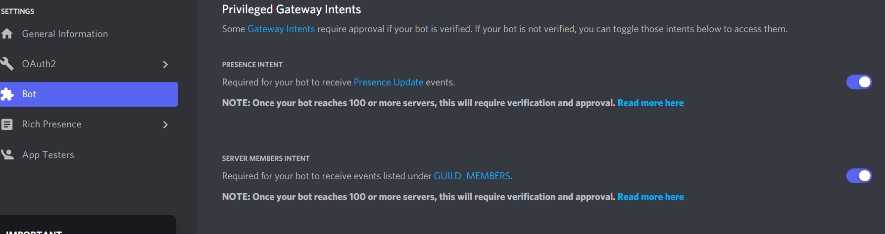

# DisPy-Bot


A Discord Bot coded using Python. Open to collaboration

La syntax pour intégrer le bot (imaginons la fonction lol_reponse dans le fichier autrecode.py) :
> Main.py
```py
import discord
from autrecode import *

@client.event
async def on_message(message):
    if message.content == "LOL":
        await lol_reponse(client,message)
```
> Autrecode.py
```py
async def lol_reponse(client,message):
    salon = message.channel
    await salon.send("Au t'es trop drole")
```

Les Permissions :
> Main.py
````py
global command_dico #Liste de toutes les commandes du bot avec leurs permitions
command_dico={"get-user-id":[],
              "dilemme": [],
              "aide": [],
              "mute": ["administrator"],
              "newrole": ["administrator","manage_roles"],
              "deleterole": ["administrator","manage_roles"],
              "addrole": ["administrator","manage_roles"],
              "removerole": ["administrator","manage_roles"],
              "devoirs": [],
              "notes": []
              }
 ````

ATTENTION : il faut que ces deux options soient autorisée pour le lancement du bot...


